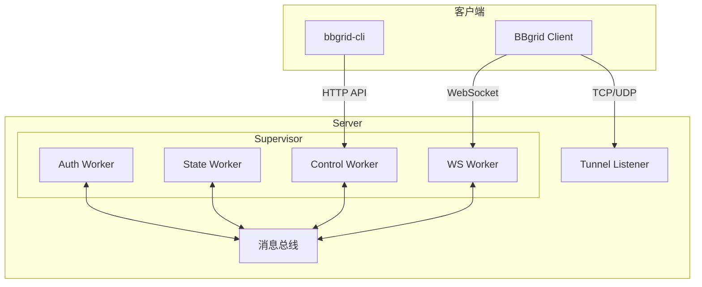
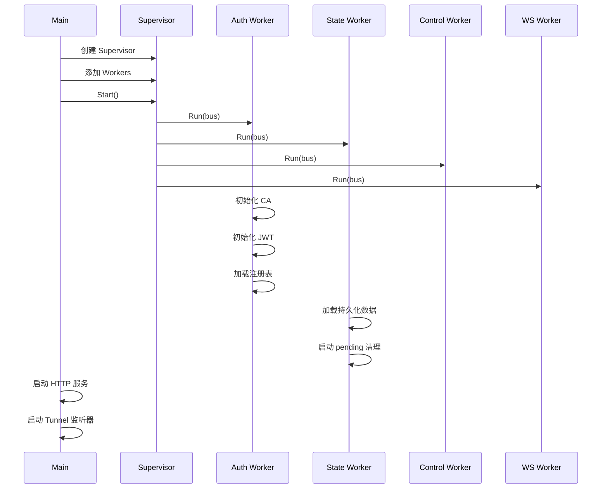
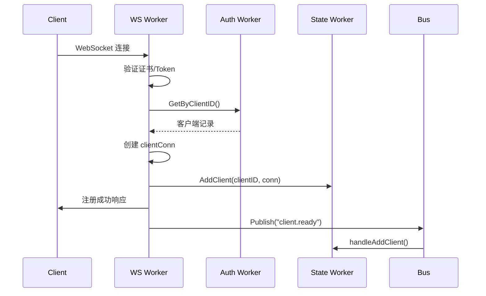
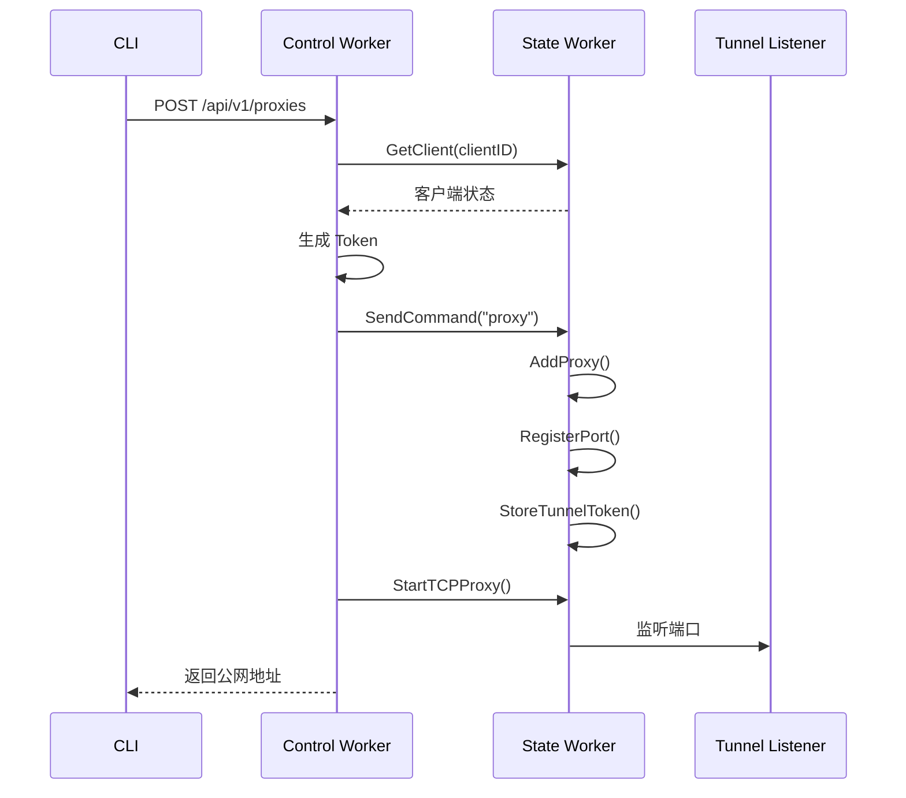
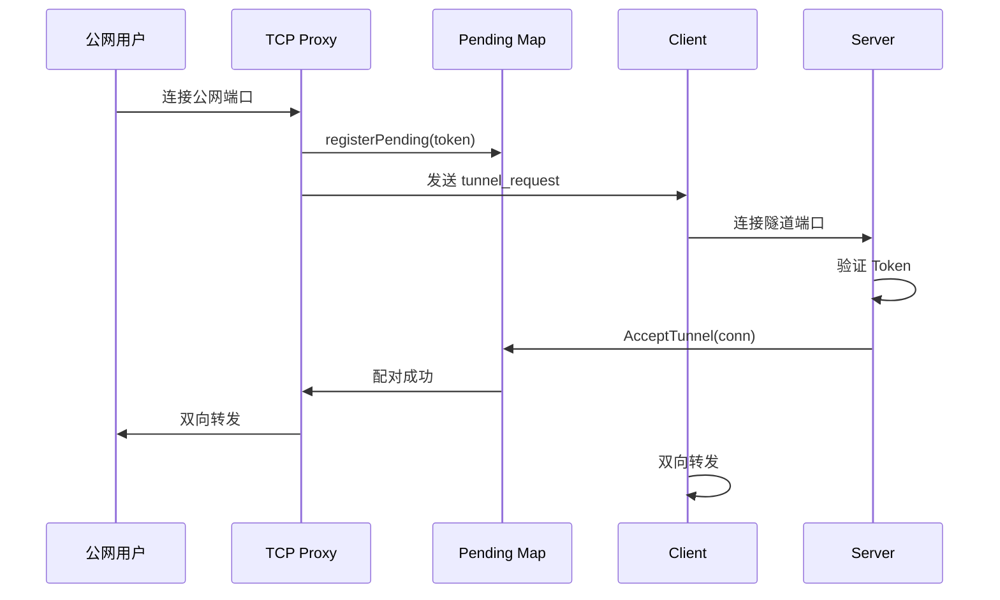
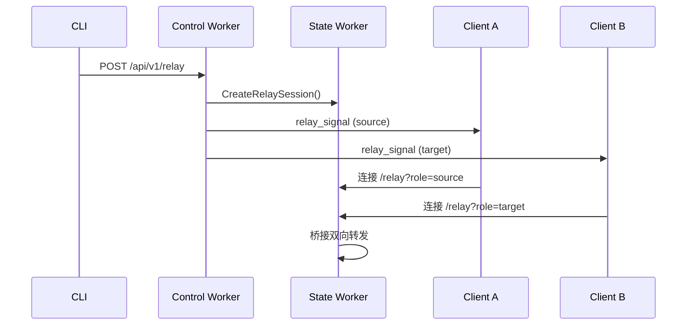
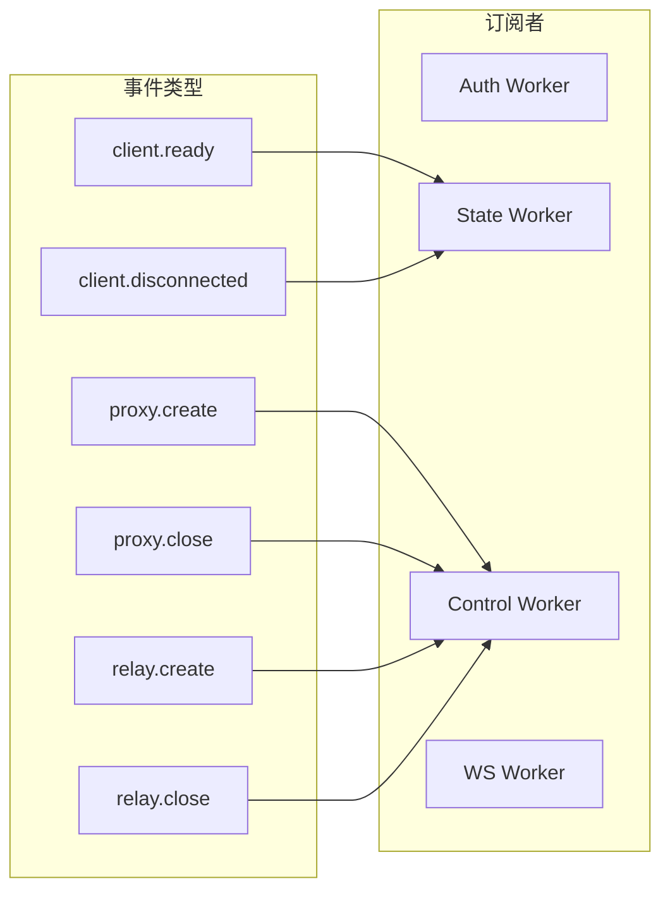
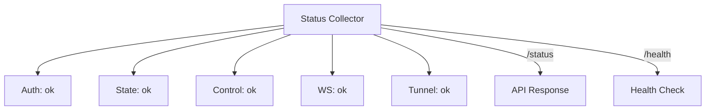

# BBgrid Server 流程图

## 整体架构

```mermaid
graph TB
    subgraph "客户端"
        CLI[bbgrid-cli]
        Client[BBgrid Client]
    end

    subgraph "Server"
        subgraph "Supervisor"
            Auth[Auth Worker]
            State[State Worker]
            Control[Control Worker]
            WS[WS Worker]
        end

        Bus[消息总线]
        Tunnel[Tunnel Listener]
    end

    CLI -->|HTTP API| Control
    Client -->|WebSocket| WS
    Client -->|TCP/UDP| Tunnel

    Auth <--> Bus
    State <--> Bus
    Control <--> Bus
    WS <--> Bus
```

## 启动流程

```mermaid
sequenceDiagram
    participant M as Main
    participant S as Supervisor
    participant A as Auth Worker
    participant ST as State Worker
    participant C as Control Worker
    participant W as WS Worker

    M->>S: 创建 Supervisor
    M->>S: 添加 Workers
    M->>S: Start()
    
    S->>A: Run(bus)
    S->>ST: Run(bus)
    S->>C: Run(bus)
    S->>W: Run(bus)
    
    A->>A: 初始化 CA
    A->>A: 初始化 JWT
    A->>A: 加载注册表
    
    ST->>ST: 加载持久化数据
    ST->>ST: 启动 pending 清理
    
    M->>M: 启动 HTTP 服务
    M->>M: 启动 Tunnel 监听器
```

## 客户端注册流程

```mermaid
sequenceDiagram
    participant C as Client
    participant W as WS Worker
    participant A as Auth Worker
    participant ST as State Worker
    participant B as Bus

    C->>W: WebSocket 连接
    W->>W: 验证证书/Token
    W->>A: GetByClientID()
    A-->>W: 客户端记录
    
    W->>W: 创建 clientConn
    W->>ST: AddClient(clientID, conn)
    W->>C: 注册成功响应
    
    W->>B: Publish("client.ready")
    B->>ST: handleAddClient()
```

## 创建代理流程

```mermaid
sequenceDiagram
    participant CLI as CLI
    participant C as Control Worker
    participant S as State Worker
    participant T as Tunnel Listener

    CLI->>C: POST /api/v1/proxies
    C->>S: GetClient(clientID)
    S-->>C: 客户端状态
    
    C->>C: 生成 Token
    C->>S: SendCommand("proxy")
    S->>S: AddProxy()
    S->>S: RegisterPort()
    S->>S: StoreTunnelToken()
    
    C->>S: StartTCPProxy()
    S->>T: 监听端口
    
    C-->>CLI: 返回公网地址
```

## 隧道连接流程

```mermaid
sequenceDiagram
    participant U as 公网用户
    participant T as TCP Proxy
    participant P as Pending Map
    participant C as Client
    participant S as Server

    U->>T: 连接公网端口
    T->>P: registerPending(token)
    T->>C: 发送 tunnel_request
    
    C->>S: 连接隧道端口
    S->>S: 验证 Token
    S->>P: AcceptTunnel(conn)
    P->>T: 配对成功
    
    T->>U: 双向转发
    C->>C: 双向转发
```

## 中继流程

```mermaid
sequenceDiagram
    participant CLI as CLI
    participant C as Control Worker
    participant S as State Worker
    participant A as Client A
    participant B as Client B

    CLI->>C: POST /api/v1/relay
    C->>S: CreateRelaySession()
    
    C->>A: relay_signal (source)
    C->>B: relay_signal (target)
    
    A->>S: 连接 /relay?role=source
    B->>S: 连接 /relay?role=target
    
    S->>S: 桥接双向转发
```

## 消息总线通信

```mermaid
graph LR
    subgraph "事件类型"
        E1[client.ready]
        E2[client.disconnected]
        E3[proxy.create]
        E4[proxy.close]
        E5[relay.create]
        E6[relay.close]
    end

    subgraph "订阅者"
        Auth[Auth Worker]
        State[State Worker]
        Control[Control Worker]
        WS[WS Worker]
    end

    E1 --> State
    E2 --> State
    E3 --> Control
    E4 --> Control
    E5 --> Control
    E6 --> Control
```

## 组件状态监控

```mermaid
graph TD
    SC[Status Collector] --> Auth[Auth: ok]
    SC --> State[State: ok]
    SC --> Control[Control: ok]
    SC --> WS[WS: ok]
    SC --> Tunnel[Tunnel: ok]
    
    SC -->|/status| API[API Response]
    SC -->|/health| Health[Health Check]
```
